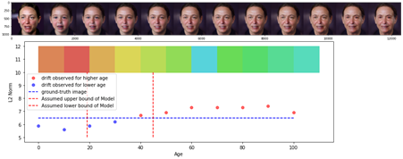
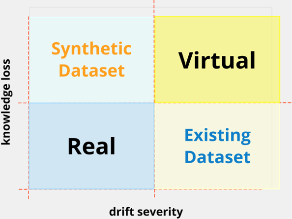
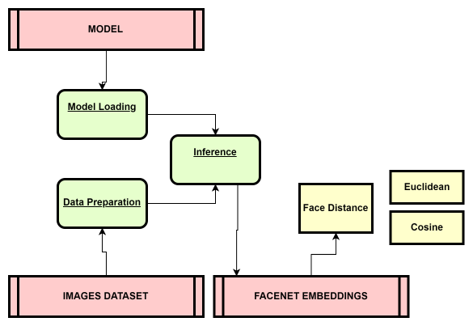
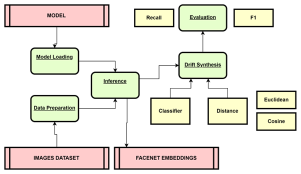
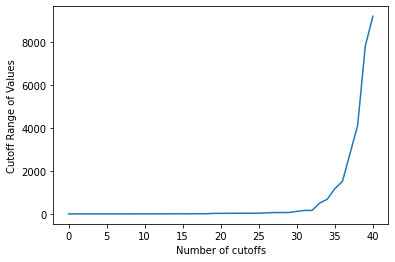
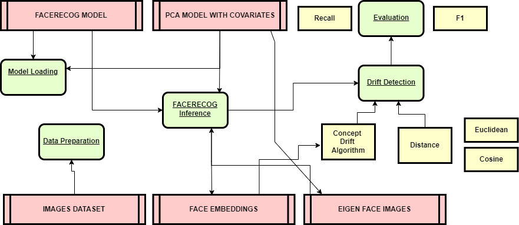
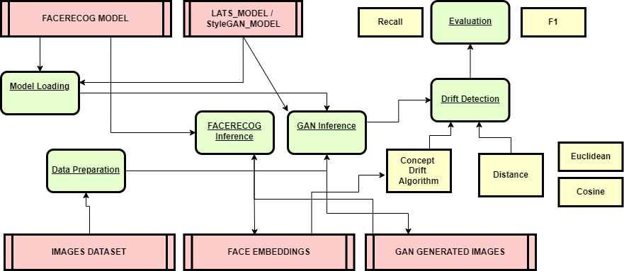

# Face Aging Concept Drift

### FOLDER STRUCTURE

```
|   LICENSE
|   README.md
|
+---images
|       decision_model.png
|       drift_metric.png
|
\---src
    |   constants.py
    |   dataloaders.py
    |   datasets.py
    |
    +---aws
    |       boto3_api.py
    |       credentials.ini
    |       credentials.rar
    |
    \---dataset_meta

            AgeDB_metadata.mat
            celebrity2000_meta.mat
            FGNET_metadata.mat
```

# **Introduction**

Concept Drift is a phenomenon through which models decay over time and show ambiguous results on Machine Learning inference. The models may decay because they have used a restricted dataset which may not contain all the necessary feature representations and encodings. Concept Drift is observed in the target labels of the data and occurs due to a change in the underlying data distribution, change in data over time and changes in the predicted output due to a change of methods of data collection. 

# **Motivation**

A paper by (Fernando E. Casado, 2022) et al. describes an algorithm called CDA-FedAvg, a version of the FedAvg algorithm applying the Concept Drift aware algorithm, implemented for activity recognition using smartphones. This is done by simulating the target variables and measuring the real target values from the activity. An evaluation of actual and simulated variables reveals an appropriate metric.

# **Metric of Choice**



_Precision/Recall_ is the metric of choice, because False Positives and False Negatives are important. 

# **Research Questions**

- If I measure Concept Drift on Existing Dataset, can I not report on another Dataset?

Knowledge loss and Dataset impact affect the Concept Drift and the drift may be severely affected on Existing Dataset. Real drifts change the true decision boundaries of the problem causing a significant drop in the classifier performance, but if the drift is non-severe, part of the knowledge can also be harnessed. This is less feasible for Virtual Concept Drifts. 

- Does Virtual and Real Concept Drift have different drift severity?

There is a knowledge loss in Virtual Concept Drift, this causes drift to be more severe for Virtual

- If Concept Drift is identity-by-identity, how can it be applied for Virtual Concept Drift with a cut-off?

The values which are clustered are originating from L2Norm. A PCA method is used for distance plotting but a Euclidean distance between the facenet embeddings would be enough for such a case. In this problem (CD), we use a stream sample of images which consists of some 1000 images of all ages and also established images which consists of a range of images by age. By comparing them, the established images form the columns and stream sample form the rows. Since the stream sample has got more data, standard error calculation will be from the stream sample. 

- How to deal with both virtual and real drifts while achieving robustness to noise?

When noise is encountered by the algorithm, some algorithms ignore them and do not detect them as drifted. Though others such as GMMs cause misclassification. Most expect the drift algorithm to detect drift by time (age parameter) and least expect drift algorithm to detect drift by noisy samples. Those that are affected by data distributions will be captured. Such drifts may be due to Existing Dataset (or usage of wrong dataset)

- How to best approach the knowledge harnessing problem from past experiences or reduce knowledge loss in the adaptation?

Ensembles of models are the approach to tackle this problem, old models are used for inferences and also previously unseen concepts are learned from scratch

- Why is the Dataset analysis for Concept Drift important for our problem?

Concept Drift ensures we can retrain the model anytime when the drift is detected. A Concept Drift analysis on the Dataset leads to identification of drift in the dataset pre-training such that effective measures can be taken in the model. This will help generate a better model while retraining

- Is Data collection for a Drift Analysis important for our problem?

Given the right memory consumption and right algorithmic complexity, one can detect the drift online and no need to collect data pre-hand. It is to evaluate the Concept Drift using an appropriate metric.

# **Decision Model**



# **Existing Datasets**

1. CACD2000

CACD2000 is a large dataset containing face images of celebrities of actors, scientists, etc. It consists of 2000 identities and the age ranges from 14 to 62:

Age Unique Values: [14, 15, 16, 17, 18, 19, 20, 21, 22, 23, 24, 25, 26, 27, 28, 29, 30,
       31, 32, 33, 34, 35, 36, 37, 38, 39, 40, 41, 42, 43, 44, 45, 46, 47,
       48, 49, 50, 51, 52, 53, 54, 55, 56, 57, 58, 59, 60, 61, 62]

2. FGNET

FGNET is a small dataset and created in 2007-2008. It consists of 1002 images and 63 identities / subjects and the age ranges from 0 to 69.

Age Unique Values: [ 0,  1,  2,  3,  4,  5,  6,  7,  8,  9, 10, 11, 12, 13, 14, 15, 16,
       17, 18, 19, 20, 21, 22, 23, 24, 25, 26, 27, 28, 29, 30, 31, 32, 33,
       34, 35, 36, 37, 38, 39, 40, 41, 42, 43, 44, 45, 46, 47, 48, 49, 50,
       51, 52, 53, 54, 55, 58, 60, 61, 62, 63, 67, 69]

3. AgeDB

AgeDB is a comparatively larger dataset. It consists of 568 subjects and 16,488 images. The Age ranges from 1 to 101. 

Age Unique Values: [  1,   3,   4,   5,   6,   7,   8,   9,  10,  11,  12,  13,  14,
        15,  16,  17,  18,  19,  20,  21,  22,  23,  24,  25,  26,  27,
        28,  29,  30,  31,  32,  33,  34,  35,  36,  37,  38,  39,  40,
        41,  42,  43,  44,  45,  46,  47,  48,  49,  50,  51,  52,  53,
        54,  55,  56,  57,  58,  59,  60,  61,  62,  63,  64,  65,  66,
        67,  68,  69,  70,  71,  72,  73,  74,  75,  76,  77,  78,  79,
        80,  81,  82,  83,  84,  85,  86,  87,  88,  89,  90,  91,  92,
        93,  94,  95,  96,  97,  98,  99, 100, 101]

# **Project Contents**

The project consists of experiments and pipelines

1. Experiments: Experiments help collect primary data from a model or service

2. Pipelines: Pipelines consist of 1 or more experiments with a logger name prefix and they are executed in a command line environment, with a frontend or programatically

## **Project Implementation**

### 1. FaceNetWithoutAging

- Experiment: [./src/experiment/facenet_without_aging.py](./src/experiment/facenet_without_aging.py)
- Pipeline: [./src/pipeline/facenet_without_aging.py](./src/pipeline/facenet_without_aging.py)

In this section, the euclidean and cosine distances are collected and plotted which are then saved using Mlflow. 



### 2. FaceNetWithAging

- Experiment: [./src/experiment/drift_synthesis_by_eigen_faces.py](./src/experiment/drift_synthesis_by_eigen_faces.py)
- Pipeline: [./src/pipeline/facenet_with_aging.py](./src/pipeline/facenet_with_aging.py)

This section performs the aging using PCA eigen faces. 



### 3 FaceRecogWithEigenFaces

- Experiment: [./src/experiment/drift_synthesis_by_eigen_faces.py](./src/experiment/drift_synthesis_by_eigen_faces.py)
- Pipeline: [./src/pipeline/facenet_with_aging.py](./src/pipeline/facenet_with_aging.py)

- Eigen faces

Eigen faces are obtained from the covariates of the images

- Hashing the Samples based on Grouping Distance

In this section, the samples are assigned numbers sequentially that correspond to the noise generated by those images using Eigen faces

- Cutoff range

In this section, the samples are assigned a cutoff range such that there is enough amount of samples in one group that correspond to the noise generated. Such a table has been shown below. The hash_sample in the table identifies the data row grouping. 

| Row Id | age | identity | **Hash_Sample** | **Grouping Distance** |
|--------|-----|----------|-------------|-----------------------|
| 1      | 56  | 2000     | 1           |        23.65              |
| 2      | 43  | 21       | 1           |        1234.76              |
| 3      | 56  | 34       | 2           |        98.56              |
| 4      | 67  | 45       | 2           |        1.2              |
| 5      | 43  | 668      | 3           |        0.004              |
| 6      | 35  | 21       | 4           |        0.07              |

This hash_sample has a **Grouping Distance** parameter for which the cutoff range is decided. 

> Such a cutoff applied to the problem of eigen faces here has been shown below:





### 4 FaceRecogWithGAN

- Experiment1: [./src/experiment/facenet_with_gan_lats.py](./src/experiment/facenet_with_gan_lats.py)
- Experiment2: [./src/experiment/facenet_with_gan_stylegan.py](./src/experiment/facenet_with_gan_stylegan.py)

- Pipeline: [./src/pipeline/facenet_with_gan_lats.py](./src/pipeline/facenet_with_gan_lats.py)
- Pipeline: [./src/pipeline/facenet_with_gan_stylegan.py](./src/pipeline/facenet_with_gan_stylegan.py)



